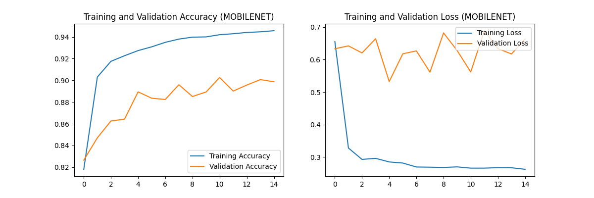

# Real-time Fruit Classification System with User Feedback Loop

## 1. Overview

This project implements a real-time fruit classification system using a deep learning model. It leverages the webcam of a MacBook (or any compatible system) to classify fruits in real-time. A key feature of this system is its interactive mode, which allows users to provide corrections for misclassifications. This feedback is then used to augment the dataset, enabling the model to be retrained and improved over time. The system supports different image resolutions and uses MobileNetV2 for efficient transfer learning.

## 2. Features

*   **Real-time Fruit Classification:** Classifies fruits from a live webcam feed.
*   **Interactive Feedback Mode:**
    *   Displays top N predictions for a captured frame.
    *   Allows users to select the correct label if the top prediction is wrong.
    *   Includes a search functionality to find the correct label from the full list of classes.
*   **User-Corrected Data Collection:** Saves user-corrected images (at the model's input resolution) into a structured directory (`user_corrected_data/<ClassName>/image.png`).
*   **Model Retraining:** The training script can incorporate images from the `user_corrected_data` directory to fine-tune and improve the model.
*   **Dataset Flexibility:**
    *   Supports the original high-resolution Fruits-360 dataset (processed at 224x224).
    *   Supports the 100x100 pixel version of the Fruits-360 dataset.
*   **Background Augmentation:** Replaces the plain white backgrounds of the Fruits-360 dataset with random background images to improve model generalization to real-world webcam images.
*   **Transfer Learning:** Uses a pre-trained MobileNetV2 model with a custom classification head.
*   **Model Versioning:** Saves trained models with version numbers (e.g., `fruit_classifier_best_v1.keras`) to keep track of improvements.
*   **Command-Line Configurability:** Scripts accept arguments for resolution and specific model loading, enhancing flexibility.

## 3. Dataset

This project uses the **Fruits-360 dataset** available on Kaggle.

*   **Kaggle Link:** [Fruits-360 Dataset](https://www.kaggle.com/datasets/moltean/fruits)

You will need to download two versions for full functionality as described:
1.  **Original Size:** The archive named something like `fruits-360_original_size.zip`.
2.  **100x100 Pixels:** The archive named `fruits-360_dataset.zip` (this one contains the 100x100 images).

See step 6 in the "Setup and Installation" section (specifically, subsections 6.1, 6.2, and 6.3) below for detailed dataset download and setup instructions.

## 4. Setup and Installation

### Prerequisites
*   Python 3.8+
*   Access to a webcam
*   Git LFS (Large File Storage) - required for model files and user data

### Steps

1.  **Clone the Repository:**
    ```bash
    git clone https://github.com/Leon-AW/fruits-360-Classifier.git
    cd fruits-360-Classifier
    ```

2.  **Install Git LFS (if not already installed):**
    Git LFS is required to properly handle the trained models (.keras files) and user-corrected images.
    
    **On macOS (using Homebrew):**
    ```bash
    brew install git-lfs
    ```
    
    **On Ubuntu/Debian:**
    ```bash
    sudo apt update
    sudo apt install git-lfs
    ```
    
    **On Windows:**
    Download and install from [git-lfs.github.io](https://git-lfs.github.io/)

3.  **Initialize Git LFS for the repository:**
    ```bash
    git lfs install
    git lfs pull
    ```
    This ensures all LFS-tracked files are properly downloaded and that any new files matching the LFS patterns will be automatically tracked.

4.  **Create a Python Virtual Environment:**
    It's highly recommended to use a virtual environment.
    ```bash
    python3 -m venv fruit_detector
    source fruit_detector/bin/activate  # On macOS/Linux
    # For Windows: .\fruit_detector\Scripts\activate
    ```

5.  **Install Dependencies:**
    Use the `requirements.txt` file should to install all needed libraries and dependencies:
    ```bash
    pip install -r requirements.txt
    ```

6.  **Detailed Dataset Download and Setup:**
    For the system to function correctly with all training options, please download and organize the datasets as follows. It's recommended to perform these steps after cloning the project and setting up your virtual environment.

    #### 6.1. Background Images (for 224x224 Augmentation)

    *   **Purpose:** These images are used as backgrounds when augmenting the Fruits-360 original size dataset (processed at 224x224 pixels).
    *   **Download Link:** [Cats vs Dogs Transformed (Kaggle)](https://www.kaggle.com/datasets/abhinavnayak/catsvdogs-transformed)
        *   From this dataset, you can use the images as backgrounds.
    *   **Target Directory:** After downloading, place the desired background images into:
        ```
        fruit_classifier_project/backgrounds/
        ```
        *Ensure these are image files (e.g., .jpg, .png).*

    #### 6.2. Background Images (for 100x100 Augmentation)

    *   **Purpose:** These images are used as backgrounds when augmenting the Fruits-360 100x100 dataset.
    *   **Download Link:** [Stanford Background Dataset (Kaggle)](https://www.kaggle.com/datasets/balraj98/stanford-background-dataset)
    *   **Instructions:**
        1.  Download the dataset, which will likely be a zip file.
        2.  Unzip the archive.
        3.  Locate the `images` folder within the unzipped contents.
    *   **Target Directory:** Copy all images from the `images` folder into:
        ```
        fruit_classifier_project/backgrounds100x100/
        ```

    #### 6.3. Fruits-360 Dataset (All Variants)

    *   **Purpose:** This is the primary dataset for fruit classification.
    *   **Main Download Link:** [Fruits-360 (Kaggle)](https://www.kaggle.com/datasets/moltean/fruits)
    *   **Instructions:**
        1.  Download the complete dataset from the Kaggle link. This usually comes as a single large archive (e.g., `archive.zip`).
        2.  Unzip the main archive. Inside, you will find several sub-archives or folders.
    *   **Target Directory Structure:** Unzip and place the relevant contents into the `fruit_classifier_project/` directory to match the following structure:
        *   `fruit_classifier_project/fruits-360_original-size/` (Contains the original, higher-resolution images)
        *   `fruit_classifier_project/fruits-360_100x100/` (Contains the 100x100 pixel images, often found in a sub-folder named `fruits-360` or `fruits-360_dataset` within the main download)
        *   `fruit_classifier_project/fruits-360-3-body-problem/`
        *   `fruit_classifier_project/fruits-360-meta/`
        *   `fruit_classifier_project/fruits-360_multi/`

        *Note: The original `README.md` might have referred to `fruits-360` for the 100x100 dataset. For clarity and to match the common naming from the "multi-variant" Kaggle download, we're using `fruits-360_100x100`. Please adjust your training scripts if they expect a different name for the 100x100 dataset folder.*

        Ensure the `Training` and `Test` (or `Validation`) subdirectories are correctly placed within `fruits-360_original-size/` and `fruits-360_100x100/`.

## 5. Getting Started

### 5.1. Running the Smart Scale GUI Application (`smart_scale_tkinter_app.py`)

This script launches a Tkinter-based GUI application that simulates a smart scale. It uses the webcam to identify fruits, allows adding them to a virtual cart, and provides features like item correction and language selection. This application typically relies on `config.py` for settings like model path and product data, and `translations.py` for multi-language support.

*   **Default (using model and settings from `config.py`):**
    ```bash
    python fruit_classifier_project/smart_scale_tkinter_app.py
    ```

*   **Specify a Model:**
    You can override the model specified in `config.py` by using the `--model` argument:
    ```bash
    python fruit_classifier_project/smart_scale_tkinter_app.py --model path/to/your_custom_model.keras
    ```
    Replace `path/to/your_custom_model.keras` with the actual path to your desired Keras model file.

**Key Features (within the GUI):**
*   Live camera feed for fruit identification.
*   Button to scan and identify the item under the camera.
*   Display of identified item, estimated weight, and price.
*   Option to correct misclassifications.
*   Virtual shopping cart to add items.
*   Checkout simulation.
*   Language selection for the GUI.

## 6. Git LFS Configuration for Contributors

This project uses **Git LFS (Large File Storage)** to efficiently handle large files like trained models and user-corrected images. The repository is already configured with a `.gitattributes` file that automatically tracks:

- **All `.keras` model files** (anywhere in the project)
- **PNG images in `user_corrected_data/`** (collected via interactive feedback)

### ✅ What This Means for Contributors

When you contribute to this project, **your new model files and user data will automatically be tracked with LFS** as long as you:

1. **Have Git LFS installed** (see installation steps above)
2. **Run `git lfs install`** after cloning (this is crucial!)

### 🔍 Current LFS Tracking Rules

The `.gitattributes` file contains these patterns:
```bash
# Track all Keras models
fruit_classifier_project/*.keras filter=lfs diff=lfs merge=lfs -text
fruit_classifier_project/**/*.keras filter=lfs diff=lfs merge=lfs -text
*.keras filter=lfs diff=lfs merge=lfs -text

# Track user-corrected data images
fruit_classifier_project/user_corrected_data/**/*.png filter=lfs diff=lfs merge=lfs -text
```

### ✨ Verification

To verify that your setup is working correctly:

```bash
# Check what files are tracked by LFS
git lfs track

# After adding a new .keras model, verify it's being tracked
git lfs ls-files | grep your_new_model.keras

# Check LFS status
git lfs status
```

### 🚀 When You Train New Models

When you train new models using `train_fruit_classifier.py`, the resulting `.keras` files will **automatically be tracked with LFS** - no manual configuration needed! Just commit and push as normal:

```bash
git add fruit_classifier_project/your_new_model_v3.keras
git commit -m "Add new improved model v3"
git push
```

## 7. Directory Structure Overview

```
fruit_detection_system/
├── .git/                     # Git repository data
├── .gitignore                # Specifies intentionally untracked files
├── fruit_classifier_project/ # Main project folder
│   ├── fruits-360_original-size/ # Original size dataset (see section 5.3)
│   ├── fruits-360_100x100/     # 100x100 dataset (see section 5.3)
│   ├── fruits-360_multi/       # Multi-fruit dataset (see section 5.3)
│   ├── fruits-360_3-body-problem/ # Specific test dataset (see section 5.3)
│   ├── fruits-360_dataset_meta/ # DEPRECATED - now fruits-360-meta (see section 5.3)
│   ├── backgrounds/            # Background images for 224x224 augmentation (see section 4, step 6.1)
│   ├── backgrounds100x100/     # Background images for 100x100 augmentation (see section 4, step 6.2)
│   ├── user_corrected_data/    # Stores images saved via interactive feedback
│   ├── train_fruit_classifier.py # Script for training/retraining the model
│   ├── interactive_fruit_classifier.py # Script for interactive classification and feedback
│   ├── realtime_fruit_classifier.py  # Script for simple real-time classification display
│   ├── print_class_names.py    # Utility script for printing class names
│   ├── config.py               # Configuration file (if used by scripts)
│   ├── translations.py         # Translation files (if used by GUI)
│   ├── smart_scale_tkinter_app.py # GUI application for smart scale functionality
│   ├── requirements.txt        # Python package dependencies
│   ├── *.keras                 # Saved models will appear here (e.g., fruit_classifier_mobilenet_best_v1.keras)
│   └── *.png                   # Training plots and sample augmentations will be saved here
├── fruit_detector/           # Python virtual environment (recommended name)
└── README.md                 # This file
```

## 8. Usage

Ensure your virtual environment is activated (`source fruit_detector/bin/activate`) before running any scripts. All commands should be run from the `fruit_detection_system` root directory.

### 8.1. Training the Model (`train_fruit_classifier.py`)

This script trains the classification model. It can use either the original-size dataset (default, 224x224) or the 100x100 dataset. It also incorporates data from `user_corrected_data/` if available.

*   **Default (Original Size - 224x224, MobileNetV2):**
    ```bash
    python fruit_classifier_project/train_fruit_classifier.py
    ```

*   **100x100 Dataset (MobileNetV2):**
    ```bash
    python fruit_classifier_project/train_fruit_classifier.py 100
    ```

*   **Specify Architecture (e.g., EfficientNetB3, default resolution):**
    ```bash
    python fruit_classifier_project/train_fruit_classifier.py arch efficientnet
    ```

*   **Specify Architecture and Resolution (e.g., EfficientNetB3, 100x100):**
    ```bash
    python fruit_classifier_project/train_fruit_classifier.py 100 arch efficientnet
    ```

**Outputs:**
*   Trained models (e.g., `fruit_classifier_mobilenet_best_v1.keras` for 224x224x3 resolution, which has demonstrated performance around 95% test accuracy as indicated by training logs and plots like `training_validation_accuracy_mobilenet.png`; an example 100x100 model like `fruit_classifier_mobilenet_best_v2.keras` (100x100x3 resolution) can achieve around 90% test accuracy; or `fruit_classifier_efficientnet_final_v1.keras` for EfficientNet models) saved in `fruit_classifier_project/`.
*   Training history plots (accuracy and loss, e.g., `training_validation_accuracy_mobilenet.png`, `training_validation_loss_mobilenet.png`) saved as PNG files in `fruit_classifier_project/`.
*   A sample batch of augmented images (`sample_augmented_batch.png`) saved in `fruit_classifier_project/`.

Here is the training validation loss plot of fruit_classifier_mobilenet_best_v2.keras that is generated by the training script:


### 8.2. Interactive Classification & Data Collection (`interactive_fruit_classifier.py`)

This script provides a webcam feed where you can classify fruits on demand and provide corrections.

*   **Default (Original Size - 224x224, latest model):**
    ```bash
    python fruit_classifier_project/interactive_fruit_classifier.py
    ```

*   **With Options:**
    *   `res 100`: Use 100x100 resolution for processing and loads class names from the 100x100 dataset structure. User-corrected images will be saved as 100x100.
    *   `model <model_name.keras>`: Load a specific Keras model file. Path can be relative to `fruit_classifier_project/` or absolute.

    **Examples:**
    ```bash
    # Use 100x100 resolution, latest 100x100 model (assumed to be compatible)
    python fruit_classifier_project/interactive_fruit_classifier.py res 100

    # Use default resolution with a specific model
    python fruit_classifier_project/interactive_fruit_classifier.py model fruit_classifier_best_v2.keras

    # Use 100x100 resolution with a specific model
    python fruit_classifier_project/interactive_fruit_classifier.py res 100 model fruit_classifier_100x100_v1.keras
    ```

**Key Controls in Interactive Mode:**
*   **`c`**: Capture the current frame and classify it. Displays top 5 predictions.
*   **`1` - `5`**: If predictions are shown, select the corresponding prediction as the correct label. The original full-resolution frame (resized to the model's input size) is saved to `user_corrected_data/ClassName/`.
*   **`s`**: Skip labeling the current classification.
*   **`f`**: After classifying (predictions are shown), press 'f' to enter search mode.
    *   **In Search Mode:** Type your search query for a fruit name.
    *   **`Enter`**: Perform the search based on your query.
    *   **`1` - `N` (up to 0 for 10th)**: Select the correct label from the filtered search results.
    *   **`Esc`**: Exit search mode (or back from search results to predictions).
*   **`q`**: Quit the application.

### 8.3. Real-time Classification Display (`realtime_fruit_classifier.py`)

This script provides a continuous real-time classification of fruits from the webcam feed, displaying the top prediction.

*   **Default (Original Size - 224x224, latest model):**
    ```bash
    python fruit_classifier_project/realtime_fruit_classifier.py
    ```

*   **With Options (same as `interactive_fruit_classifier.py`

## 9. Potential Future Improvements

*   More sophisticated data augmentation techniques.
*   Allow fine-tuning of later layers in the MobileNetV2 base model after initial training.
*   Develop a more user-friendly GUI (e.g., using Tkinter, PyQt, or a web interface).
*   Experiment with other efficient model architectures (e.g., EfficientNet).
*   Implement object detection (drawing bounding boxes around fruits) instead of full-frame classification for scenarios with multiple fruits or cluttered backgrounds.
*   Add options for adjusting confidence thresholds for display. 